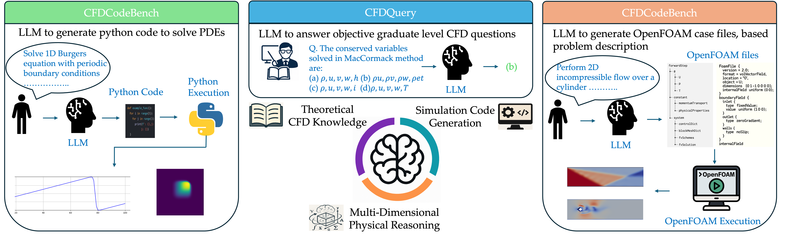
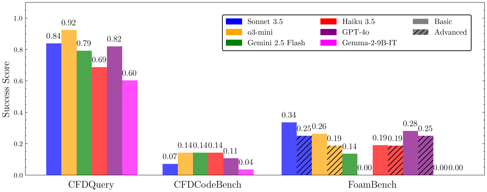

# CFDLLMBench

**CFDLLMBench** is a comprehensive benchmark suite designed to assess Large Language Models (LLMs) on key competencies relevant to computational fluid dynamics (CFD). It evaluates LLMs across three interconnected tasks:

- ✅ **CFDQuery**: Conceptual understanding through multiple-choice CFD questions.
- ✅ **CFDCodeBench**: Instruction-following ability to generate CFD code.
- ✅ **FoamBench**: End-to-end automation of OpenFOAM simulations from natural language.

---

## 🔍 Motivation

While LLMs excel in general NLP, their ability to reason about scientific systems, generate structured physical code, and interface with domain-specific simulators like OpenFOAM remains underexplored.

**CFDLLMBench** bridges this gap by systematically measuring:
- Conceptual grasp of CFD principles (via QA),
- Structured code generation fidelity,
- Robustness of simulation execution and output.

---

## 🧱 Benchmark Components

### 📘 CFDQuery

- 108 graduate-level multiple-choice questions from CFD lectures.
- Covers numerical methods, turbulence modeling, and solver theory.
- LLMs select the correct option from four choices.

### 🔧 CFDCodeBench

- 24 natural language prompts describing CFD problems.
- Models must output executable CFD code (FDM, FVM, etc.).
- Evaluated on correctness, numerical stability, and output similarity.

### 🌀 FoamBench

- 110 Basic + 15 Advanced OpenFOAM simulation tasks.
- Benchmarks end-to-end tool use: case creation → execution → postprocessing.
- Assesses multi-step reasoning, domain adaptation, and recovery.

---

## 📊 Evaluation Metrics

Each benchmark employs domain-aware metrics:

| Metric         | Description                                      |
|----------------|--------------------------------------------------|
| `M_exec`       | Whether the simulation runs to completion        |
| `M_nmse`       | Normalized mean squared error vs ground truth    |
| `M_bleu`       | Code generation similarity (ROUGE-based)         |
| `M_tree`       | Directory-level structural match score           |
| `Success Ratio`| Composite: Full marks only if `M_exec` and `M_nmse` both pass |

---

## 🖼️ Benchmark Overview



---

## 📈 Example Results



---

## 🧪 Running the Benchmarks

Clone the repository and install requirements:

```bash
git clone https://github.com/<your-org>/CFDLLMBench.git
cd CFDLLMBench
```

### Step 1: Unpack the Benchmarks

```bash
python read_json_basic.py     # Unpacks FoamBench basic benchmark
python read_json_advanced.py  # Unpacks FoamBench advanced benchmark
```

### Step 2: Run the Algorithm

Make sure your algorithm is inside `algorithm/YourMethod/` and contains a valid `run_workflow.py`.

Example (MetaOpenFOAM):
```bash
cd algorithm/
git clone https://github.com/<your-org>/MetaOpenFOAM.git
```

Run:
```bash
python run_benchmarks.py
```

Outputs will be saved in `Dataset/Basic/[dataset]/[1-10]/` and `Dataset/Advanced/`.

```
Dataset/
└── Basic/
    └── Cavity/
        └── 1/
            ├── GT_Files/
            └── run_output/   ← from MetaOpenFOAM
└── Advanced/
    └── BernardCells/
        ├── GT_Files/
        └── run_output/
```

---

## 📊 Postprocessing and Scoring

To compute scores:

```bash
python execution_report.py    # Generates basic/advanced execution reports
python similarity_report.py   # Code similarity (ROUGE)
python nmse_report.py         # Field-level numerical accuracy
python score_calculation.py   # Aggregates all into final metrics
```

Results will include:
- Per-case and per-dataset scores
- `M_exec`, `M_nmse`, `M_tree`, `M_bleu`, and Success Ratio

---

## 📄 License

This benchmark is open-source and released under [your license].

