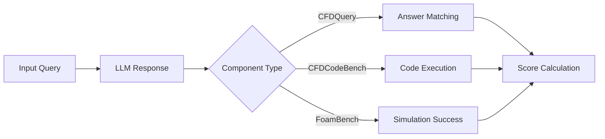

# Benchmark Components Overview

CFDLLMBench consists of three complementary evaluation tasks designed to comprehensively assess LLM capabilities in computational fluid dynamics.

## Design Philosophy

Our benchmark follows a hierarchical evaluation approach:

1. **Conceptual Understanding** (CFDQuery) - Foundation knowledge
2. **Code Generation** (CFDCodeBench) - Applied implementation  
3. **Tool Integration** (FoamBench) - End-to-end automation

## Component Breakdown

| Component | Type | Tasks | Evaluation Metric |
|-----------|------|-------|------------------|
| CFDQuery | Multiple Choice | 90 questions | Accuracy |
| CFDCodeBench | Code Generation | 24 problems | Execution + Similarity |
| FoamBench | Tool Use | 126 simulations | Success Rate |

## Evaluation Pipeline

## Learn More

- [CFDQuery Details](cfdquery.md)
- [CFDCodeBench Details](cfdcodebench.md) 
- [FoamBench Details](foambench.md)
