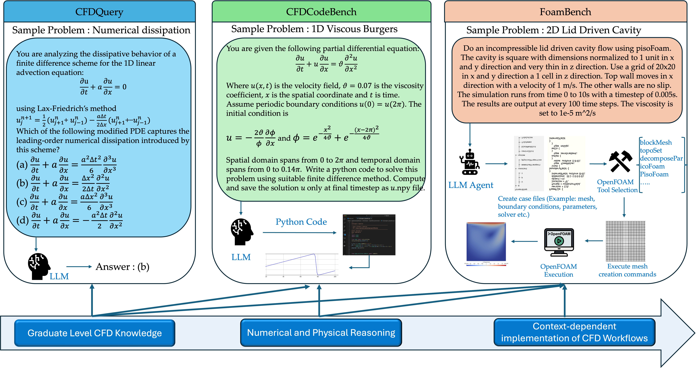

# CFDLLMBench

**CFDLLMBench** is a comprehensive benchmark suite designed to assess Large Language Models (LLMs) on key competencies relevant to computational fluid dynamics (CFD).

## :dart: Overview

CFDLLMBench evaluates LLMs across three interconnected tasks:

- :white_check_mark: **CFDQuery**: Conceptual understanding through multiple-choice CFD questions
- :white_check_mark: **CFDCodeBench**: Instruction-following ability to generate CFD code  
- :white_check_mark: **FoamBench**: End-to-end automation of OpenFOAM simulations from natural language

## :bulb: Motivation

While LLMs excel in general NLP, their ability to reason about scientific systems, generate structured physical code, and interface with domain-specific simulators like OpenFOAM remains underexplored.

**CFDLLMBench** bridges this gap by systematically measuring:

- Conceptual grasp of CFD principles (via QA)
- Structured code generation fidelity
- Robustness of simulation execution and output

## :rocket: Quick Start

Get started with CFDLLMBench in just a few steps:

1. **Installation**: Follow our [Getting Started Guide](getting-started.md)
2. **Run Benchmarks**: Execute the evaluation suite on your LLM
3. **Analyze Results**: Compare performance across all three tasks

## :chart_with_upwards_trend: Key Results

Our comprehensive evaluation reveals significant challenges for current LLMs in scientific computing domains, with substantial room for improvement in CFD-specific reasoning and tool use.

## :books: Benchmark Components

### CFDQuery
90 graduate-level multiple-choice questions covering numerical methods, turbulence modeling, and solver theory.

### CFDCodeBench  
24 natural language prompts requiring executable CFD code generation with evaluation on correctness and numerical stability.

### FoamBench
126 OpenFOAM simulation tasks (110 Basic + 16 Advanced) benchmarking end-to-end tool use from case creation to postprocessing.

[Learn more about our benchmark components →](components/overview.md)

## :handshake: Contributing

We welcome contributions from the community! Check out our [Contributing Guide](contributing.md) to get started.

## :page_facing_up: License

This benchmark is open-source and released under the **BSD-3-Clause** license.
