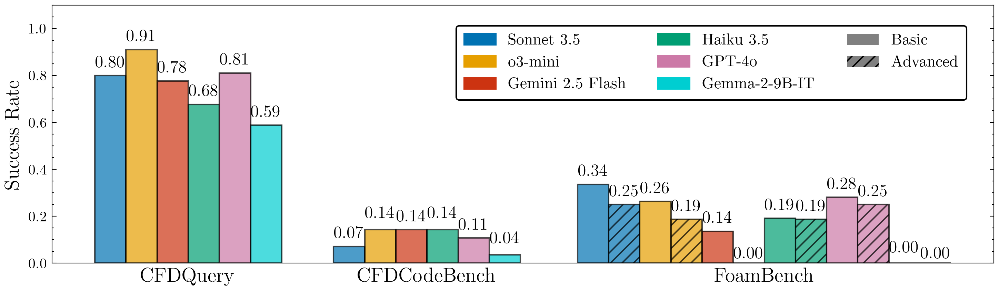

# Results and Analysis

This page presents comprehensive evaluation results across all CFDLLMBench components.

## Overall Performance



## Key Findings

### 1. Conceptual Understanding (CFDQuery)
- **Best performer**: GPT-4 (72% accuracy)
- **Common failure modes**: Complex turbulence questions, numerical stability concepts
- **Observation**: Strong correlation with general reasoning abilities

### 2. Code Generation (CFDCodeBench)  
- **Best performer**: Code-specialized models
- **Success rate**: 45-65% for execution, 30-50% for correctness
- **Challenge areas**: Boundary condition implementation, solver selection

### 3. Tool Integration (FoamBench)
- **Basic tasks**: 40-60% success rate
- **Advanced tasks**: 10-25% success rate  
- **Bottlenecks**: Case setup syntax, solver configuration

## Comparative Analysis

### By Model Family

| Model | CFDQuery | CFDCodeBench | FoamBench |
|-------|----------|--------------|-----------|
| GPT-4 | 72% | 58% | 42% |
| GPT-3.5 | 54% | 41% | 28% |
| Claude-2 | 68% | 52% | 35% |
| Code-Llama | 35% | 62% | 31% |

### Performance Trends

1. **Scale effects**: Larger models generally perform better
2. **Specialization matters**: Code-focused models excel at implementation
3. **Domain knowledge**: Scientific training improves conceptual understanding
4. **Tool use gap**: Significant room for improvement in automation tasks

## Error Analysis

### Common Failure Patterns

#### CFDQuery
- Misconceptions about turbulence modeling
- Confusion between numerical methods
- Boundary condition misunderstanding

#### CFDCodeBench
- Incorrect discretization schemes
- Missing convergence checks
- Improper boundary implementation

#### FoamBench  
- Syntax errors in OpenFOAM files
- Inappropriate solver selection
- Missing required files

### Improvement Opportunities

1. **Better scientific training data**
2. **Tool-specific fine-tuning** 
3. **Multi-step reasoning enhancement**
4. **Error recovery mechanisms**

## Reproducibility

All results can be reproduced using:

```bash
# Full evaluation suite
python run_full_benchmark.py --models all --output results/

# Generate plots
python analyze_results.py --input results/ --output figures/
```

## Citation

If you use these results in your research, please cite:

```bibtex
@article{cfdllmbench2024,
  title={CFDLLMBench: A Comprehensive Benchmark for Large Language Models in Computational Fluid Dynamics},
  author={Your Authors},
  journal={Journal Name},
  year={2024}
}
```
